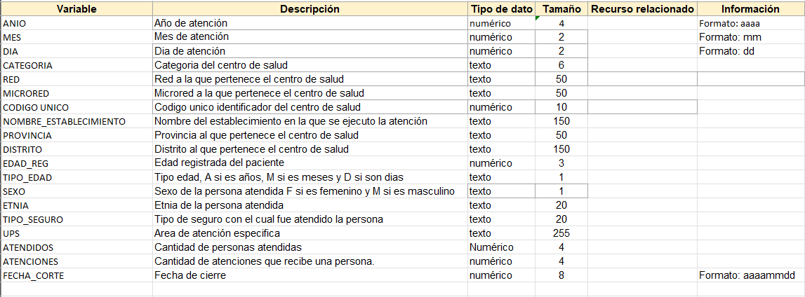

# Proyecto Atenciones y Atendidos Region San Martin

Esta aplicación gestiona la colocación de créditos de FMV. Ofrece las siguientes funcionalidades:
- **Listar** atenciones.
- **Registrar** una atencion.
- **Importar** datos desde un archivo Excel (.xlsx).


## Requisitos

- **Java 21** (asegúrese de tener el JDK adecuado instalado).
- **Maven** (para compilar y empaquetar la aplicación).
- **Docker** y **Docker Compose** (opcional, para desplegar la aplicación en contenedores).
- **PostgreSQL** (la base de datos se levanta automáticamente con Docker Compose).

## Configuración

La conexión a la base de datos y el puerto de la aplicación se definen mediante variables de entorno en el archivo `application.properties`:
``` properties
spring.datasource.url=jdbc:postgresql://${DB_HOST}:${DB_PORT}/${DB_NAME}
spring.datasource.username=${DB_USERNAME:postgres}
spring.datasource.password=${DB_PASSWORD:0racle}
spring.datasource.driver-class-name=org.postgresql.Driver

spring.jpa.hibernate.ddl-auto=update
spring.jpa.show-sql=true
server.port=${SERVER_PORT:8080}
```
## Archivo .env
Cree un archivo .env en la raíz del despliegue (junto al docker-compose.yml):

```properties
# Configuración de la base de datos
POSTGRES_DB=TuBaseDatos
POSTGRES_USER=TuUsuario
POSTGRES_PASSWORD=TuContraseña

# Configuración del servidor
SPRING_PORT = 8000
CONTEXT_PATH=/
```

## Despliegue con Docker
La aplicación está dockerizada y se puede levantar junto a su base de datos PostgreSQL usando Docker Compose.

1. Asegúrese de tener Docker y Docker Compose instalados.
2. En el directorio raíz del proyecto (donde se encuentran el Dockerfile y el docker-compose.yml), ejecute:
```
    docker-compose up --build
    docker-compose up -d
```
3. La API estará disponible en http://localhost:8002.

## Endpoints Principales
* **Registrar Atenciones**
  ```POST /api/atenciones```
* **Listar Atenciones**
  ```GET /api/atenciones```
* **Importar Excel**
  ```POST /api/atenciones/importar```
## Importar Datos ( POST /api/atenciones/importar)
* ### Diccionario de Datos

* ### Ejecutar Api
    1. #### Usando cURL :
  Puedes usar cURL desde la terminal. Supongamos que tu archivo Excel se llama atenciones.xlsx y está en la carpeta actual, la instrucción sería:
     ``` 
  curl -X POST -F archivo=@atenciones.xlsx http://localhost:8002/api/atenciones/importar
    ```
  En este comando, -F archivo=@atenciones.xlsx indica que se envía el archivo en la clave archivo.

    2. #### Usando Postman

        1. Selecciona el método:\
           Configura la solicitud como POST y establece la URL: http://localhost:8002/api/atenciones/importar.

        2. Configurar Body
            * En la pestaña Body de Postman, selecciona la opción form-data.
            * Agrega un nuevo key con el nombre **archivo**.
            * En la columna Type, selecciona File.
            * Adjunta el archivo Excel (creditos.xlsx).

        3. Enviar la petición:\
           Haz clic en Send. Si el archivo se importa correctamente, recibirás en la respuesta una lista de objetos de tipo atencion con la información insertada en la base de datos.